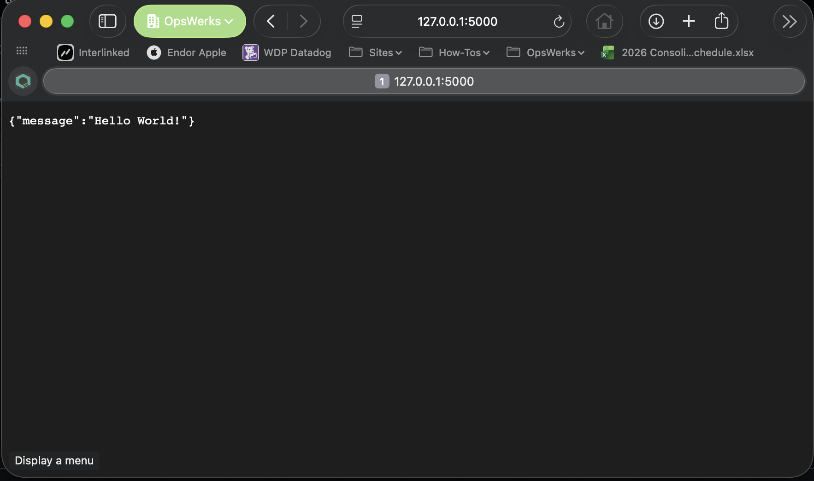

# Simple Python App using Flask




# Steps:
```
git clone git@github.com:opswerks-lab/python-webapp.git
cd python-webapp
pip install -r requirements.txt
flask run

Go to localhost:5000 or 127.0.0.1:5000
```